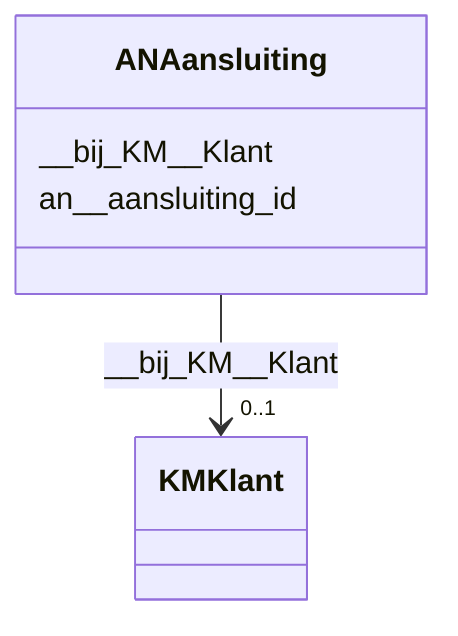

# Class: ANAansluiting


_De beschrijving van dit begrip is gekoppeld aan de [URI](https://dbpedia.org/page/Uniform_Resource_Identifier)._


URI: [an:Aansluiting](https://data.alliander.com/an/Aansluiting)





<!-- no inheritance hierarchy -->


## Slots

| Name | Cardinality and Range | Description | Inheritance |
| ---  | --- | --- | --- |
| [an__aansluiting_id](an__aansluiting_id.md) | 1 <br/> [String](String.md) | De beschrijving van dit attribuut is gekoppeld aan de [URI](https://dbpedia | direct |
| [__bij_KM__Klant](__bij_KM__Klant.md) | 0..1 <br/> [KMKlant](KMKlant.md) | De beschrijving van deze relatie is gekoppeld aan de [URI](https://dbpedia | direct |


## Usages

| used by | used in | type | used |
| ---  | --- | --- | --- |
| [KMKlant](KMKlant.md) | [__heeft_AN__Aansluiting](__heeft_AN__Aansluiting.md) | range | [ANAansluiting](ANAansluiting.md) |


## Identifier and Mapping Information


### Schema Source


* from schema: http://l-aw65qy.alliander.local:1180/#index


## Mappings

| Mapping Type | Mapped Value |
| ---  | ---  |
| self | an:Aansluiting |
| native | this:ANAansluiting |


## LinkML Source

<!-- TODO: investigate https://stackoverflow.com/questions/37606292/how-to-create-tabbed-code-blocks-in-mkdocs-or-sphinx -->

### Direct

<details>
```yaml
name: AN__Aansluiting
description: De beschrijving van dit begrip is gekoppeld aan de [URI](https://dbpedia.org/page/Uniform_Resource_Identifier).
from_schema: http://l-aw65qy.alliander.local:1180/#index
slots:
- an__aansluiting_id
- _ bij KM__Klant
slot_usage:
  name: _ bij KM__Klant
  domain_of:
  - AN__Aansluiting
  required: false
  multivalued: false
class_uri: an:Aansluiting

```
</details>

### Induced

<details>
```yaml
name: AN__Aansluiting
description: De beschrijving van dit begrip is gekoppeld aan de [URI](https://dbpedia.org/page/Uniform_Resource_Identifier).
from_schema: http://l-aw65qy.alliander.local:1180/#index
slot_usage:
  name: _ bij KM__Klant
  domain_of:
  - AN__Aansluiting
  required: false
  multivalued: false
attributes:
  an__aansluiting_id:
    name: an__aansluiting_id
    description: De beschrijving van dit attribuut is gekoppeld aan de [URI](https://dbpedia.org/page/Uniform_Resource_Identifier).
    from_schema: http://l-aw65qy.alliander.local:1180/#index
    rank: 1000
    slot_uri: att:n__aansluiting_id
    identifier: true
    alias: an__aansluiting_id
    owner: AN__Aansluiting
    domain_of:
    - AN__Aansluiting
    range: string
  _ bij KM__Klant:
    name: _ bij KM__Klant
    description: De beschrijving van deze relatie is gekoppeld aan de [URI](https://dbpedia.org/page/Uniform_Resource_Identifier).
    from_schema: http://l-aw65qy.alliander.local:1180/#index
    rank: 1000
    slot_uri: rel:bij_KM__Klant
    alias: __bij_KM__Klant
    owner: AN__Aansluiting
    domain_of:
    - AN__Aansluiting
    range: KM__Klant
    required: false
    multivalued: false
class_uri: an:Aansluiting

```
</details>