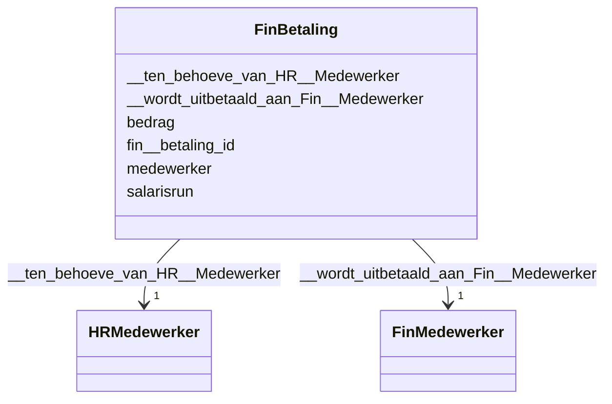

# Class: FinBetaling


_De beschrijving van dit begrip is gekoppeld aan de [URI](https://dbpedia.org/page/Uniform_Resource_Identifier)._


URI: [schema:PaymentService](http://schema.org/PaymentService)





<!-- no inheritance hierarchy -->


## Slots

| Name | Cardinality and Range | Description | Inheritance |
| ---  | --- | --- | --- |
| [fin__betaling_id](fin__betaling_id.md) | 1 <br/> [String](String.md) | De beschrijving van dit attribuut is gekoppeld aan de [URI](https://dbpedia | direct |
| [bedrag](bedrag.md) | 0..1 <br/> [Float](Float.md) | De beschrijving van dit attribuut is gekoppeld aan de [URI](https://dbpedia | direct |
| [medewerker](medewerker.md) | 0..1 <br/> [String](String.md) | De beschrijving van dit attribuut is gekoppeld aan de [URI](https://dbpedia | direct |
| [salarisrun](salarisrun.md) | 0..1 <br/> [String](String.md) | De beschrijving van dit attribuut is gekoppeld aan de [URI](https://dbpedia | direct |
| [__wordt_uitbetaald_aan_Fin__Medewerker](__wordt_uitbetaald_aan_Fin__Medewerker.md) | 1 <br/> [FinMedewerker](FinMedewerker.md) | De beschrijving van deze relatie is gekoppeld aan de [URI](https://dbpedia | direct |
| [__ten_behoeve_van_HR__Medewerker](__ten_behoeve_van_HR__Medewerker.md) | 1 <br/> [HRMedewerker](HRMedewerker.md) | De beschrijving van deze relatie is gekoppeld aan de [URI](https://dbpedia | direct |


## Usages

| used by | used in | type | used |
| ---  | --- | --- | --- |
| [FinMedewerker](FinMedewerker.md) | [__krijgt_Fin__Betaling](__krijgt_Fin__Betaling.md) | range | [FinBetaling](FinBetaling.md) |
| [HRMedewerker](HRMedewerker.md) | [__krijgt_Fin__Betaling](__krijgt_Fin__Betaling.md) | range | [FinBetaling](FinBetaling.md) |


## Identifier and Mapping Information


### Schema Source


* from schema: http://l-aw65qy.alliander.local:1180/#index


## Mappings

| Mapping Type | Mapped Value |
| ---  | ---  |
| self | schema:PaymentService |
| native | this:FinBetaling |


## LinkML Source

<!-- TODO: investigate https://stackoverflow.com/questions/37606292/how-to-create-tabbed-code-blocks-in-mkdocs-or-sphinx -->

### Direct

<details>
```yaml
name: Fin__Betaling
description: De beschrijving van dit begrip is gekoppeld aan de [URI](https://dbpedia.org/page/Uniform_Resource_Identifier).
from_schema: http://l-aw65qy.alliander.local:1180/#index
slots:
- fin__betaling_id
- bedrag
- medewerker
- salarisrun
- _ wordt uitbetaald aan Fin__Medewerker
- _ ten behoeve van HR__Medewerker
slot_usage:
  _ wordt uitbetaald aan Fin__Medewerker:
    name: _ wordt uitbetaald aan Fin__Medewerker
    domain_of:
    - Fin__Betaling
    required: true
    multivalued: false
  _ ten behoeve van HR__Medewerker:
    name: _ ten behoeve van HR__Medewerker
    domain_of:
    - Fin__Betaling
    required: true
    multivalued: false
class_uri: schema:PaymentService

```
</details>

### Induced

<details>
```yaml
name: Fin__Betaling
description: De beschrijving van dit begrip is gekoppeld aan de [URI](https://dbpedia.org/page/Uniform_Resource_Identifier).
from_schema: http://l-aw65qy.alliander.local:1180/#index
slot_usage:
  _ wordt uitbetaald aan Fin__Medewerker:
    name: _ wordt uitbetaald aan Fin__Medewerker
    domain_of:
    - Fin__Betaling
    required: true
    multivalued: false
  _ ten behoeve van HR__Medewerker:
    name: _ ten behoeve van HR__Medewerker
    domain_of:
    - Fin__Betaling
    required: true
    multivalued: false
attributes:
  fin__betaling_id:
    name: fin__betaling_id
    description: De beschrijving van dit attribuut is gekoppeld aan de [URI](https://dbpedia.org/page/Uniform_Resource_Identifier).
    from_schema: http://l-aw65qy.alliander.local:1180/#index
    rank: 1000
    slot_uri: att:fin__betaling_id
    identifier: true
    alias: fin__betaling_id
    owner: Fin__Betaling
    domain_of:
    - Fin__Betaling
    range: string
    required: true
  bedrag:
    name: bedrag
    description: De beschrijving van dit attribuut is gekoppeld aan de [URI](https://dbpedia.org/page/Uniform_Resource_Identifier).
    from_schema: http://l-aw65qy.alliander.local:1180/#index
    rank: 1000
    slot_uri: att:bedrag
    identifier: false
    alias: bedrag
    owner: Fin__Betaling
    domain_of:
    - Fin__Betaling
    range: float
  medewerker:
    name: medewerker
    description: De beschrijving van dit attribuut is gekoppeld aan de [URI](https://dbpedia.org/page/Uniform_Resource_Identifier).
    from_schema: http://l-aw65qy.alliander.local:1180/#index
    rank: 1000
    slot_uri: att:medewerker
    identifier: false
    alias: medewerker
    owner: Fin__Betaling
    domain_of:
    - Fin__Betaling
    range: string
  salarisrun:
    name: salarisrun
    description: De beschrijving van dit attribuut is gekoppeld aan de [URI](https://dbpedia.org/page/Uniform_Resource_Identifier).
    from_schema: http://l-aw65qy.alliander.local:1180/#index
    rank: 1000
    slot_uri: att:salarisrun
    identifier: false
    alias: salarisrun
    owner: Fin__Betaling
    domain_of:
    - Fin__Betaling
    range: string
  _ wordt uitbetaald aan Fin__Medewerker:
    name: _ wordt uitbetaald aan Fin__Medewerker
    description: De beschrijving van deze relatie is gekoppeld aan de [URI](https://dbpedia.org/page/Uniform_Resource_Identifier).
    from_schema: http://l-aw65qy.alliander.local:1180/#index
    rank: 1000
    slot_uri: rel:wordt_uitbetaald_aan_Fin__Medewerker
    alias: __wordt_uitbetaald_aan_Fin__Medewerker
    owner: Fin__Betaling
    domain_of:
    - Fin__Betaling
    range: Fin__Medewerker
    required: true
    multivalued: false
  _ ten behoeve van HR__Medewerker:
    name: _ ten behoeve van HR__Medewerker
    description: De beschrijving van deze relatie is gekoppeld aan de [URI](https://dbpedia.org/page/Uniform_Resource_Identifier).
    from_schema: http://l-aw65qy.alliander.local:1180/#index
    rank: 1000
    slot_uri: rel:ten_behoeve_van_HR__Medewerker
    alias: __ten_behoeve_van_HR__Medewerker
    owner: Fin__Betaling
    domain_of:
    - Fin__Betaling
    range: HR__Medewerker
    required: true
    multivalued: false
class_uri: schema:PaymentService

```
</details>