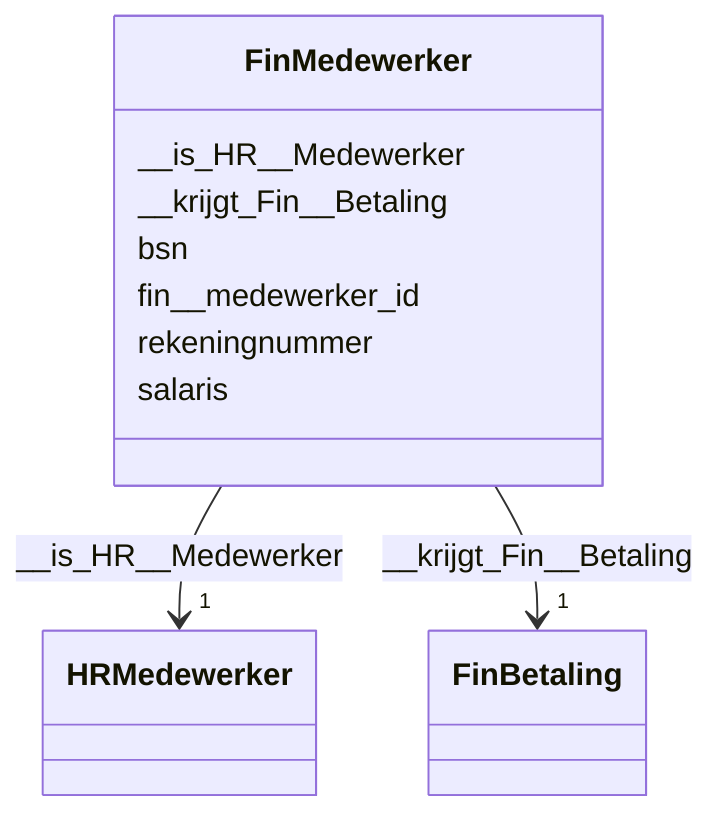

# Class: FinMedewerker


_De beschrijving van dit begrip is gekoppeld aan de [URI](https://dbpedia.org/page/Uniform_Resource_Identifier)._


URI: [fin:Medewerker](https://data.alliander.com/fin/Medewerker)





<!-- no inheritance hierarchy -->


## Slots

| Name | Cardinality and Range | Description | Inheritance |
| ---  | --- | --- | --- |
| [fin__medewerker_id](fin__medewerker_id.md) | 1 <br/> [String](String.md) | De beschrijving van dit attribuut is gekoppeld aan de [URI](https://dbpedia | direct |
| [bsn](bsn.md) | 0..1 <br/> [String](String.md) | De beschrijving van dit attribuut is gekoppeld aan de [URI](https://dbpedia | direct |
| [rekeningnummer](rekeningnummer.md) | 0..1 <br/> [String](String.md) | De beschrijving van dit attribuut is gekoppeld aan de [URI](https://dbpedia | direct |
| [salaris](salaris.md) | 0..1 <br/> [Float](Float.md) | De beschrijving van dit attribuut is gekoppeld aan de [URI](https://dbpedia | direct |
| [__is_HR__Medewerker](__is_HR__Medewerker.md) | 1 <br/> [HRMedewerker](HRMedewerker.md) | De beschrijving van deze relatie is gekoppeld aan de [URI](https://dbpedia | direct |
| [__krijgt_Fin__Betaling](__krijgt_Fin__Betaling.md) | 1 <br/> [FinBetaling](FinBetaling.md) | De beschrijving van deze relatie is gekoppeld aan de [URI](https://dbpedia | direct |


## Usages

| used by | used in | type | used |
| ---  | --- | --- | --- |
| [FinBetaling](FinBetaling.md) | [__wordt_uitbetaald_aan_Fin__Medewerker](__wordt_uitbetaald_aan_Fin__Medewerker.md) | range | [FinMedewerker](FinMedewerker.md) |
| [HRMedewerker](HRMedewerker.md) | [__is_Fin__Medewerker](__is_Fin__Medewerker.md) | range | [FinMedewerker](FinMedewerker.md) |


## Identifier and Mapping Information


### Schema Source


* from schema: http://l-aw65qy.alliander.local:1180/#index


## Mappings

| Mapping Type | Mapped Value |
| ---  | ---  |
| self | fin:Medewerker |
| native | this:FinMedewerker |


## LinkML Source

<!-- TODO: investigate https://stackoverflow.com/questions/37606292/how-to-create-tabbed-code-blocks-in-mkdocs-or-sphinx -->

### Direct

<details>
```yaml
name: Fin__Medewerker
description: De beschrijving van dit begrip is gekoppeld aan de [URI](https://dbpedia.org/page/Uniform_Resource_Identifier).
from_schema: http://l-aw65qy.alliander.local:1180/#index
slots:
- fin__medewerker_id
- bsn
- rekeningnummer
- salaris
- _ is HR__Medewerker
- _ krijgt Fin__Betaling
slot_usage:
  _ is HR__Medewerker:
    name: _ is HR__Medewerker
    domain_of:
    - Fin__Medewerker
    - KM__Klant
    required: true
    multivalued: false
  _ krijgt Fin__Betaling:
    name: _ krijgt Fin__Betaling
    domain_of:
    - Fin__Medewerker
    - HR__Medewerker
    required: true
    multivalued: false
class_uri: fin:Medewerker

```
</details>

### Induced

<details>
```yaml
name: Fin__Medewerker
description: De beschrijving van dit begrip is gekoppeld aan de [URI](https://dbpedia.org/page/Uniform_Resource_Identifier).
from_schema: http://l-aw65qy.alliander.local:1180/#index
slot_usage:
  _ is HR__Medewerker:
    name: _ is HR__Medewerker
    domain_of:
    - Fin__Medewerker
    - KM__Klant
    required: true
    multivalued: false
  _ krijgt Fin__Betaling:
    name: _ krijgt Fin__Betaling
    domain_of:
    - Fin__Medewerker
    - HR__Medewerker
    required: true
    multivalued: false
attributes:
  fin__medewerker_id:
    name: fin__medewerker_id
    description: De beschrijving van dit attribuut is gekoppeld aan de [URI](https://dbpedia.org/page/Uniform_Resource_Identifier).
    from_schema: http://l-aw65qy.alliander.local:1180/#index
    rank: 1000
    slot_uri: att:fin__medewerker_id
    identifier: true
    alias: fin__medewerker_id
    owner: Fin__Medewerker
    domain_of:
    - Fin__Medewerker
    range: string
    required: true
  bsn:
    name: bsn
    description: De beschrijving van dit attribuut is gekoppeld aan de [URI](https://dbpedia.org/page/Uniform_Resource_Identifier).
    from_schema: http://l-aw65qy.alliander.local:1180/#index
    rank: 1000
    slot_uri: att:bsn
    identifier: false
    alias: bsn
    owner: Fin__Medewerker
    domain_of:
    - Fin__Medewerker
    - HR__Medewerker
    range: string
  rekeningnummer:
    name: rekeningnummer
    description: De beschrijving van dit attribuut is gekoppeld aan de [URI](https://dbpedia.org/page/Uniform_Resource_Identifier).
    from_schema: http://l-aw65qy.alliander.local:1180/#index
    rank: 1000
    slot_uri: att:rekeningnummer
    identifier: false
    alias: rekeningnummer
    owner: Fin__Medewerker
    domain_of:
    - Fin__Medewerker
    range: string
  salaris:
    name: salaris
    description: De beschrijving van dit attribuut is gekoppeld aan de [URI](https://dbpedia.org/page/Uniform_Resource_Identifier).
    from_schema: http://l-aw65qy.alliander.local:1180/#index
    rank: 1000
    slot_uri: att:salaris
    identifier: false
    alias: salaris
    owner: Fin__Medewerker
    domain_of:
    - Fin__Medewerker
    range: float
  _ is HR__Medewerker:
    name: _ is HR__Medewerker
    description: De beschrijving van deze relatie is gekoppeld aan de [URI](https://dbpedia.org/page/Uniform_Resource_Identifier).
    from_schema: http://l-aw65qy.alliander.local:1180/#index
    rank: 1000
    slot_uri: rel:is_HR__Medewerker
    alias: __is_HR__Medewerker
    owner: Fin__Medewerker
    domain_of:
    - Fin__Medewerker
    - KM__Klant
    range: HR__Medewerker
    required: true
    multivalued: false
  _ krijgt Fin__Betaling:
    name: _ krijgt Fin__Betaling
    description: De beschrijving van deze relatie is gekoppeld aan de [URI](https://dbpedia.org/page/Uniform_Resource_Identifier).
    from_schema: http://l-aw65qy.alliander.local:1180/#index
    rank: 1000
    slot_uri: rel:krijgt_Fin__Betaling
    alias: __krijgt_Fin__Betaling
    owner: Fin__Medewerker
    domain_of:
    - Fin__Medewerker
    - HR__Medewerker
    range: Fin__Betaling
    required: true
    multivalued: false
class_uri: fin:Medewerker

```
</details>