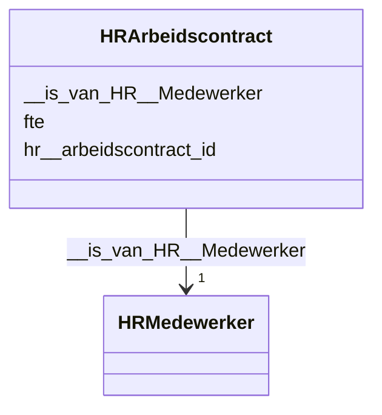

# Class: HRArbeidscontract


_De beschrijving van dit begrip is gekoppeld aan de [URI](https://dbpedia.org/page/Uniform_Resource_Identifier)._


URI: [hr:Arbeidscontract](https://data.alliander.com/hr/Arbeidscontract)





<!-- no inheritance hierarchy -->


## Slots

| Name | Cardinality and Range | Description | Inheritance |
| ---  | --- | --- | --- |
| [hr__arbeidscontract_id](hr__arbeidscontract_id.md) | 1 <br/> [String](String.md) | De beschrijving van dit attribuut is gekoppeld aan de [URI](https://dbpedia | direct |
| [fte](fte.md) | 0..1 <br/> [Float](Float.md) | De beschrijving van dit attribuut is gekoppeld aan de [URI](https://dbpedia | direct |
| [__is_van_HR__Medewerker](__is_van_HR__Medewerker.md) | 1 <br/> [HRMedewerker](HRMedewerker.md) | De beschrijving van deze relatie is gekoppeld aan de [URI](https://dbpedia | direct |


## Usages

| used by | used in | type | used |
| ---  | --- | --- | --- |
| [HRMedewerker](HRMedewerker.md) | [__heeft_HR__Arbeidscontract](__heeft_HR__Arbeidscontract.md) | range | [HRArbeidscontract](HRArbeidscontract.md) |


## Identifier and Mapping Information


### Schema Source


* from schema: http://l-aw65qy.alliander.local:1180/#index


## Mappings

| Mapping Type | Mapped Value |
| ---  | ---  |
| self | hr:Arbeidscontract |
| native | this:HRArbeidscontract |


## LinkML Source

<!-- TODO: investigate https://stackoverflow.com/questions/37606292/how-to-create-tabbed-code-blocks-in-mkdocs-or-sphinx -->

### Direct

<details>
```yaml
name: HR__Arbeidscontract
description: De beschrijving van dit begrip is gekoppeld aan de [URI](https://dbpedia.org/page/Uniform_Resource_Identifier).
from_schema: http://l-aw65qy.alliander.local:1180/#index
slots:
- hr__arbeidscontract_id
- fte
- _ is van HR__Medewerker
slot_usage:
  name: _ is van HR__Medewerker
  domain_of:
  - HR__Arbeidscontract
  required: true
  multivalued: false
class_uri: hr:Arbeidscontract

```
</details>

### Induced

<details>
```yaml
name: HR__Arbeidscontract
description: De beschrijving van dit begrip is gekoppeld aan de [URI](https://dbpedia.org/page/Uniform_Resource_Identifier).
from_schema: http://l-aw65qy.alliander.local:1180/#index
slot_usage:
  name: _ is van HR__Medewerker
  domain_of:
  - HR__Arbeidscontract
  required: true
  multivalued: false
attributes:
  hr__arbeidscontract_id:
    name: hr__arbeidscontract_id
    description: De beschrijving van dit attribuut is gekoppeld aan de [URI](https://dbpedia.org/page/Uniform_Resource_Identifier).
    from_schema: http://l-aw65qy.alliander.local:1180/#index
    rank: 1000
    slot_uri: att:hr__arbeidscontract_id
    identifier: true
    alias: hr__arbeidscontract_id
    owner: HR__Arbeidscontract
    domain_of:
    - HR__Arbeidscontract
    range: string
    required: true
  fte:
    name: fte
    description: De beschrijving van dit attribuut is gekoppeld aan de [URI](https://dbpedia.org/page/Uniform_Resource_Identifier).
    from_schema: http://l-aw65qy.alliander.local:1180/#index
    rank: 1000
    slot_uri: att:fte
    identifier: false
    alias: fte
    owner: HR__Arbeidscontract
    domain_of:
    - HR__Arbeidscontract
    range: float
  _ is van HR__Medewerker:
    name: _ is van HR__Medewerker
    description: De beschrijving van deze relatie is gekoppeld aan de [URI](https://dbpedia.org/page/Uniform_Resource_Identifier).
    from_schema: http://l-aw65qy.alliander.local:1180/#index
    rank: 1000
    slot_uri: rel:is_van_HR__Medewerker
    alias: __is_van_HR__Medewerker
    owner: HR__Arbeidscontract
    domain_of:
    - HR__Arbeidscontract
    range: HR__Medewerker
    required: true
    multivalued: false
class_uri: hr:Arbeidscontract

```
</details>