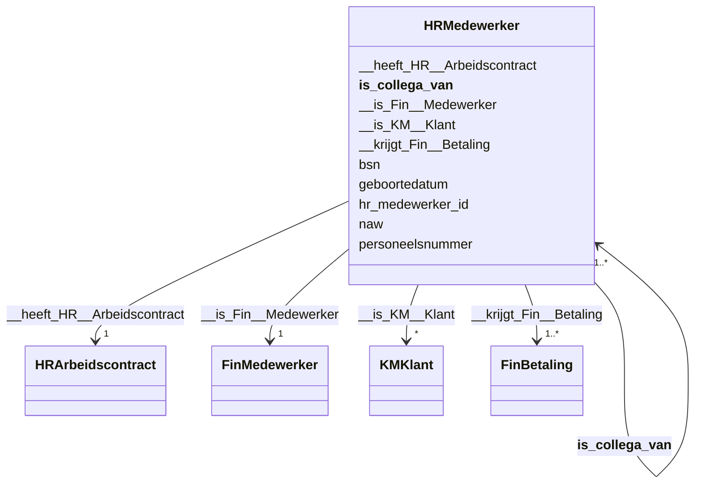

# Class: HRMedewerker


_De beschrijving van dit begrip is gekoppeld aan de [URI](https://dbpedia.org/page/Uniform_Resource_Identifier)._


URI: [hr:Medewerker](https://data.alliander.com/hr/Medewerker)





<!-- no inheritance hierarchy -->


## Slots

| Name | Cardinality and Range | Description | Inheritance |
| ---  | --- | --- | --- |
| [hr_medewerker_id](hr_medewerker_id.md) | 1 <br/> [String](String.md) | De beschrijving van dit attribuut is gekoppeld aan de [URI](https://dbpedia | direct |
| [naw](naw.md) | 0..1 <br/> [String](String.md) | De beschrijving van dit attribuut is gekoppeld aan de [URI](https://dbpedia | direct |
| [bsn](bsn.md) | 0..1 <br/> [String](String.md) | De beschrijving van dit attribuut is gekoppeld aan de [URI](https://dbpedia | direct |
| [geboortedatum](geboortedatum.md) | 0..1 <br/> [Datetime](Datetime.md) | De beschrijving van dit attribuut is gekoppeld aan de [URI](https://dbpedia | direct |
| [personeelsnummer](personeelsnummer.md) | 0..1 <br/> [Integer](Integer.md) | De beschrijving van dit attribuut is gekoppeld aan de [URI](https://dbpedia | direct |
| [__is_collega_van__](__is_collega_van__.md) | 1..* <br/> [HRMedewerker](HRMedewerker.md) | De beschrijving van deze relatie is gekoppeld aan de [URI](https://dbpedia | direct |
| [__heeft_HR__Arbeidscontract](__heeft_HR__Arbeidscontract.md) | 1 <br/> [HRArbeidscontract](HRArbeidscontract.md) | De beschrijving van deze relatie is gekoppeld aan de [URI](https://dbpedia | direct |
| [__is_Fin__Medewerker](__is_Fin__Medewerker.md) | 1 <br/> [FinMedewerker](FinMedewerker.md) | De beschrijving van deze relatie is gekoppeld aan de [URI](https://dbpedia | direct |
| [__is_KM__Klant](__is_KM__Klant.md) | * <br/> [KMKlant](KMKlant.md) | De beschrijving van deze relatie is gekoppeld aan de [URI](https://dbpedia | direct |
| [__krijgt_Fin__Betaling](__krijgt_Fin__Betaling.md) | 1..* <br/> [FinBetaling](FinBetaling.md) | De beschrijving van deze relatie is gekoppeld aan de [URI](https://dbpedia | direct |


## Usages

| used by | used in | type | used |
| ---  | --- | --- | --- |
| [FinBetaling](FinBetaling.md) | [__ten_behoeve_van_HR__Medewerker](__ten_behoeve_van_HR__Medewerker.md) | range | [HRMedewerker](HRMedewerker.md) |
| [FinMedewerker](FinMedewerker.md) | [__is_HR__Medewerker](__is_HR__Medewerker.md) | range | [HRMedewerker](HRMedewerker.md) |
| [HRArbeidscontract](HRArbeidscontract.md) | [__is_van_HR__Medewerker](__is_van_HR__Medewerker.md) | range | [HRMedewerker](HRMedewerker.md) |
| [HRMedewerker](HRMedewerker.md) | [__is_collega_van__](__is_collega_van__.md) | range | [HRMedewerker](HRMedewerker.md) |
| [KMKlant](KMKlant.md) | [__is_HR__Medewerker](__is_HR__Medewerker.md) | range | [HRMedewerker](HRMedewerker.md) |


## Identifier and Mapping Information


### Schema Source


* from schema: http://l-aw65qy.alliander.local:1180/#index


## Mappings

| Mapping Type | Mapped Value |
| ---  | ---  |
| self | hr:Medewerker |
| native | this:HRMedewerker |


## LinkML Source

<!-- TODO: investigate https://stackoverflow.com/questions/37606292/how-to-create-tabbed-code-blocks-in-mkdocs-or-sphinx -->

### Direct

<details>
```yaml
name: HR__Medewerker
description: De beschrijving van dit begrip is gekoppeld aan de [URI](https://dbpedia.org/page/Uniform_Resource_Identifier).
from_schema: http://l-aw65qy.alliander.local:1180/#index
slots:
- hr_medewerker_id
- naw
- bsn
- geboortedatum
- personeelsnummer
- _ is collega van _
- _ heeft HR__Arbeidscontract
- _ is Fin__Medewerker
- _ is KM__Klant
- _ krijgt Fin__Betaling
slot_usage:
  _ is collega van _:
    name: _ is collega van _
    domain_of:
    - HR__Medewerker
    required: true
    multivalued: true
  _ heeft HR__Arbeidscontract:
    name: _ heeft HR__Arbeidscontract
    domain_of:
    - HR__Medewerker
    required: true
    multivalued: false
  _ is Fin__Medewerker:
    name: _ is Fin__Medewerker
    domain_of:
    - HR__Medewerker
    required: true
    multivalued: false
  _ is KM__Klant:
    name: _ is KM__Klant
    domain_of:
    - HR__Medewerker
    required: false
    multivalued: true
  _ krijgt Fin__Betaling:
    name: _ krijgt Fin__Betaling
    domain_of:
    - Fin__Medewerker
    - HR__Medewerker
    required: true
    multivalued: true
class_uri: hr:Medewerker

```
</details>

### Induced

<details>
```yaml
name: HR__Medewerker
description: De beschrijving van dit begrip is gekoppeld aan de [URI](https://dbpedia.org/page/Uniform_Resource_Identifier).
from_schema: http://l-aw65qy.alliander.local:1180/#index
slot_usage:
  _ is collega van _:
    name: _ is collega van _
    domain_of:
    - HR__Medewerker
    required: true
    multivalued: true
  _ heeft HR__Arbeidscontract:
    name: _ heeft HR__Arbeidscontract
    domain_of:
    - HR__Medewerker
    required: true
    multivalued: false
  _ is Fin__Medewerker:
    name: _ is Fin__Medewerker
    domain_of:
    - HR__Medewerker
    required: true
    multivalued: false
  _ is KM__Klant:
    name: _ is KM__Klant
    domain_of:
    - HR__Medewerker
    required: false
    multivalued: true
  _ krijgt Fin__Betaling:
    name: _ krijgt Fin__Betaling
    domain_of:
    - Fin__Medewerker
    - HR__Medewerker
    required: true
    multivalued: true
attributes:
  hr_medewerker_id:
    name: hr_medewerker_id
    description: De beschrijving van dit attribuut is gekoppeld aan de [URI](https://dbpedia.org/page/Uniform_Resource_Identifier).
    from_schema: http://l-aw65qy.alliander.local:1180/#index
    rank: 1000
    slot_uri: att:hr_medewerker_id
    identifier: true
    alias: hr_medewerker_id
    owner: HR__Medewerker
    domain_of:
    - HR__Medewerker
    range: string
    required: true
  naw:
    name: naw
    description: De beschrijving van dit attribuut is gekoppeld aan de [URI](https://dbpedia.org/page/Uniform_Resource_Identifier).
    from_schema: http://l-aw65qy.alliander.local:1180/#index
    rank: 1000
    slot_uri: att:naw
    identifier: false
    alias: naw
    owner: HR__Medewerker
    domain_of:
    - HR__Medewerker
    - KM__Klant
    range: string
  bsn:
    name: bsn
    description: De beschrijving van dit attribuut is gekoppeld aan de [URI](https://dbpedia.org/page/Uniform_Resource_Identifier).
    from_schema: http://l-aw65qy.alliander.local:1180/#index
    rank: 1000
    slot_uri: att:bsn
    identifier: false
    alias: bsn
    owner: HR__Medewerker
    domain_of:
    - Fin__Medewerker
    - HR__Medewerker
    range: string
  geboortedatum:
    name: geboortedatum
    description: De beschrijving van dit attribuut is gekoppeld aan de [URI](https://dbpedia.org/page/Uniform_Resource_Identifier).
    from_schema: http://l-aw65qy.alliander.local:1180/#index
    rank: 1000
    slot_uri: att:geboortedatum
    identifier: false
    alias: geboortedatum
    owner: HR__Medewerker
    domain_of:
    - HR__Medewerker
    range: datetime
  personeelsnummer:
    name: personeelsnummer
    description: De beschrijving van dit attribuut is gekoppeld aan de [URI](https://dbpedia.org/page/Uniform_Resource_Identifier).
    from_schema: http://l-aw65qy.alliander.local:1180/#index
    rank: 1000
    slot_uri: att:personeelsnummer
    identifier: false
    alias: personeelsnummer
    owner: HR__Medewerker
    domain_of:
    - HR__Medewerker
    range: integer
  _ is collega van _:
    name: _ is collega van _
    description: De beschrijving van deze relatie is gekoppeld aan de [URI](https://dbpedia.org/page/Uniform_Resource_Identifier).
    from_schema: http://l-aw65qy.alliander.local:1180/#index
    rank: 1000
    slot_uri: rel:is_collega_van__
    alias: __is_collega_van__
    owner: HR__Medewerker
    domain_of:
    - HR__Medewerker
    range: HR__Medewerker
    required: true
    multivalued: true
  _ heeft HR__Arbeidscontract:
    name: _ heeft HR__Arbeidscontract
    description: De beschrijving van deze relatie is gekoppeld aan de [URI](https://dbpedia.org/page/Uniform_Resource_Identifier).
    from_schema: http://l-aw65qy.alliander.local:1180/#index
    rank: 1000
    slot_uri: rel:heeft_HR__Arbeidscontract
    alias: __heeft_HR__Arbeidscontract
    owner: HR__Medewerker
    domain_of:
    - HR__Medewerker
    range: HR__Arbeidscontract
    required: true
    multivalued: false
  _ is Fin__Medewerker:
    name: _ is Fin__Medewerker
    description: De beschrijving van deze relatie is gekoppeld aan de [URI](https://dbpedia.org/page/Uniform_Resource_Identifier).
    from_schema: http://l-aw65qy.alliander.local:1180/#index
    rank: 1000
    slot_uri: rel:is_Fin__Medewerker
    alias: __is_Fin__Medewerker
    owner: HR__Medewerker
    domain_of:
    - HR__Medewerker
    range: Fin__Medewerker
    required: true
    multivalued: false
  _ is KM__Klant:
    name: _ is KM__Klant
    description: De beschrijving van deze relatie is gekoppeld aan de [URI](https://dbpedia.org/page/Uniform_Resource_Identifier).
    from_schema: http://l-aw65qy.alliander.local:1180/#index
    rank: 1000
    slot_uri: rel:is_KM__Klant
    alias: __is_KM__Klant
    owner: HR__Medewerker
    domain_of:
    - HR__Medewerker
    range: KM__Klant
    required: false
    multivalued: true
  _ krijgt Fin__Betaling:
    name: _ krijgt Fin__Betaling
    description: De beschrijving van deze relatie is gekoppeld aan de [URI](https://dbpedia.org/page/Uniform_Resource_Identifier).
    from_schema: http://l-aw65qy.alliander.local:1180/#index
    rank: 1000
    slot_uri: rel:krijgt_Fin__Betaling
    alias: __krijgt_Fin__Betaling
    owner: HR__Medewerker
    domain_of:
    - Fin__Medewerker
    - HR__Medewerker
    range: Fin__Betaling
    required: true
    multivalued: true
class_uri: hr:Medewerker

```
</details>