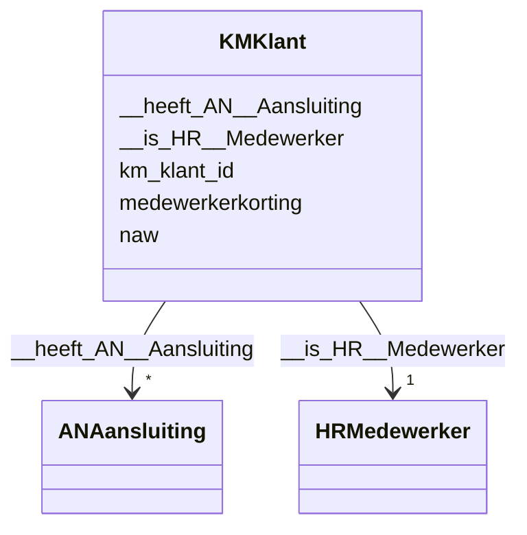

# Class: KMKlant


_De beschrijving van dit begrip is gekoppeld aan de [URI](https://dbpedia.org/page/Uniform_Resource_Identifier)._


URI: [km:Klant](https://data.alliander.com/km/Klant)





<!-- no inheritance hierarchy -->


## Slots

| Name | Cardinality and Range | Description | Inheritance |
| ---  | --- | --- | --- |
| [km_klant_id](km_klant_id.md) | 1 <br/> [String](String.md) | De beschrijving van dit attribuut is gekoppeld aan de [URI](https://dbpedia | direct |
| [naw](naw.md) | 0..1 <br/> [String](String.md) | De beschrijving van dit attribuut is gekoppeld aan de [URI](https://dbpedia | direct |
| [medewerkerkorting](medewerkerkorting.md) | 0..1 <br/> [Float](Float.md) | De beschrijving van dit attribuut is gekoppeld aan de [URI](https://dbpedia | direct |
| [__heeft_AN__Aansluiting](__heeft_AN__Aansluiting.md) | * <br/> [ANAansluiting](ANAansluiting.md) | De beschrijving van deze relatie is gekoppeld aan de [URI](https://dbpedia | direct |
| [__is_HR__Medewerker](__is_HR__Medewerker.md) | 1 <br/> [HRMedewerker](HRMedewerker.md) | De beschrijving van deze relatie is gekoppeld aan de [URI](https://dbpedia | direct |


## Usages

| used by | used in | type | used |
| ---  | --- | --- | --- |
| [ANAansluiting](ANAansluiting.md) | [__bij_KM__Klant](__bij_KM__Klant.md) | range | [KMKlant](KMKlant.md) |
| [HRMedewerker](HRMedewerker.md) | [__is_KM__Klant](__is_KM__Klant.md) | range | [KMKlant](KMKlant.md) |


## Identifier and Mapping Information


### Schema Source


* from schema: http://l-aw65qy.alliander.local:1180/#index


## Mappings

| Mapping Type | Mapped Value |
| ---  | ---  |
| self | km:Klant |
| native | this:KMKlant |


## LinkML Source

<!-- TODO: investigate https://stackoverflow.com/questions/37606292/how-to-create-tabbed-code-blocks-in-mkdocs-or-sphinx -->

### Direct

<details>
```yaml
name: KM__Klant
description: De beschrijving van dit begrip is gekoppeld aan de [URI](https://dbpedia.org/page/Uniform_Resource_Identifier).
from_schema: http://l-aw65qy.alliander.local:1180/#index
slots:
- km_klant_id
- naw
- medewerkerkorting
- _ heeft AN__Aansluiting
- _ is HR__Medewerker
slot_usage:
  _ heeft AN__Aansluiting:
    name: _ heeft AN__Aansluiting
    domain_of:
    - KM__Klant
    required: false
    multivalued: true
  _ is HR__Medewerker:
    name: _ is HR__Medewerker
    domain_of:
    - Fin__Medewerker
    - KM__Klant
    required: true
    multivalued: false
class_uri: km:Klant

```
</details>

### Induced

<details>
```yaml
name: KM__Klant
description: De beschrijving van dit begrip is gekoppeld aan de [URI](https://dbpedia.org/page/Uniform_Resource_Identifier).
from_schema: http://l-aw65qy.alliander.local:1180/#index
slot_usage:
  _ heeft AN__Aansluiting:
    name: _ heeft AN__Aansluiting
    domain_of:
    - KM__Klant
    required: false
    multivalued: true
  _ is HR__Medewerker:
    name: _ is HR__Medewerker
    domain_of:
    - Fin__Medewerker
    - KM__Klant
    required: true
    multivalued: false
attributes:
  km_klant_id:
    name: km_klant_id
    description: De beschrijving van dit attribuut is gekoppeld aan de [URI](https://dbpedia.org/page/Uniform_Resource_Identifier).
    from_schema: http://l-aw65qy.alliander.local:1180/#index
    rank: 1000
    slot_uri: att:km_klant_id
    identifier: true
    alias: km_klant_id
    owner: KM__Klant
    domain_of:
    - KM__Klant
    range: string
    required: true
  naw:
    name: naw
    description: De beschrijving van dit attribuut is gekoppeld aan de [URI](https://dbpedia.org/page/Uniform_Resource_Identifier).
    from_schema: http://l-aw65qy.alliander.local:1180/#index
    rank: 1000
    slot_uri: att:naw
    identifier: false
    alias: naw
    owner: KM__Klant
    domain_of:
    - HR__Medewerker
    - KM__Klant
    range: string
  medewerkerkorting:
    name: medewerkerkorting
    description: De beschrijving van dit attribuut is gekoppeld aan de [URI](https://dbpedia.org/page/Uniform_Resource_Identifier).
    from_schema: http://l-aw65qy.alliander.local:1180/#index
    rank: 1000
    slot_uri: att:medewerkerkorting
    identifier: false
    alias: medewerkerkorting
    owner: KM__Klant
    domain_of:
    - KM__Klant
    range: float
  _ heeft AN__Aansluiting:
    name: _ heeft AN__Aansluiting
    description: De beschrijving van deze relatie is gekoppeld aan de [URI](https://dbpedia.org/page/Uniform_Resource_Identifier).
    from_schema: http://l-aw65qy.alliander.local:1180/#index
    rank: 1000
    slot_uri: rel:heeft_AN__Aansluiting
    alias: __heeft_AN__Aansluiting
    owner: KM__Klant
    domain_of:
    - KM__Klant
    range: AN__Aansluiting
    required: false
    multivalued: true
  _ is HR__Medewerker:
    name: _ is HR__Medewerker
    description: De beschrijving van deze relatie is gekoppeld aan de [URI](https://dbpedia.org/page/Uniform_Resource_Identifier).
    from_schema: http://l-aw65qy.alliander.local:1180/#index
    rank: 1000
    slot_uri: rel:is_HR__Medewerker
    alias: __is_HR__Medewerker
    owner: KM__Klant
    domain_of:
    - Fin__Medewerker
    - KM__Klant
    range: HR__Medewerker
    required: true
    multivalued: false
class_uri: km:Klant

```
</details>